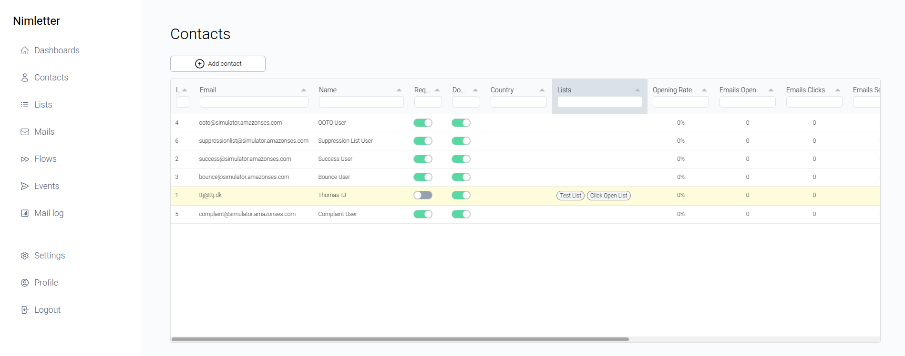
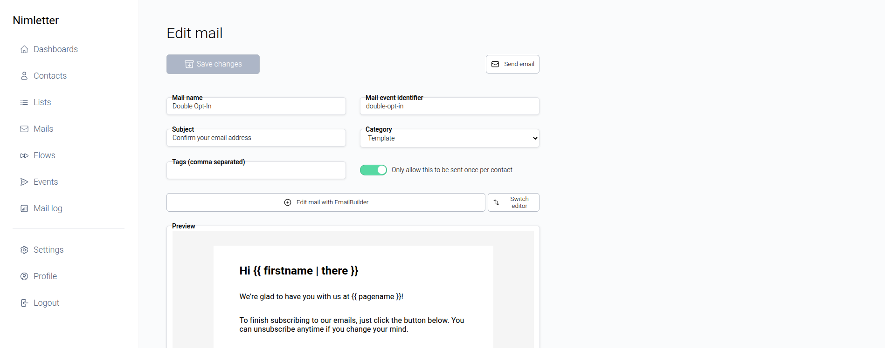
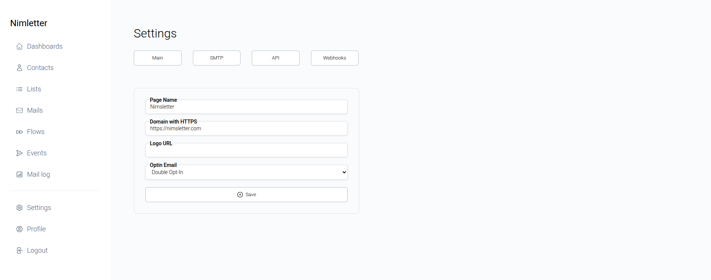

# Nimletter

**Self-hosted newsletter, drip and transactional email system**.

Nimletter is built with the purpose to replace the simple functionalities found
in Mailchimp, Mailerlite, Sendgrid and others. Let users subscribe and
automatically start flows, or just send out your weekly newsletter.


* BYOD SMTP server
* Drag and Drop email builder
* Variables / Attributes in mails
* Drip campaigns
* Transactional emails
* Bounce, complaint, open and click tracking
* Subscribe and double opt-in
* Webhook for Zapier, etc.
* API with simple endpoints
* Yubikey OTP security
* Customizable templates
* Customizable settings

## Dashboard


## Contacts



## Mail preview



## Mail builder


## Flows / Drips


## Settings




**Reason for development**:

I needed a simple system to design and send out my newsletter, but also sending drip
campaigns with tips and tricks when new users signed up. Besides those two
core features I also needed to keep track of bounces and complaints to keep my
domain reputation.

That was doable with the big players, but I wanted to have full control over
the system and the user data (GDPR and syncing to my SaaS).
So I ended up with something like Mailerlite for campaigns and Google
templates for newsletters...


# Startup

## Start the database
Create the database for starters:
```
psql -U postgres -c "CREATE USER nimsletter WITH PASSWORD 'nimsletter';"
psql -U postgres -c "CREATE DATABASE nimsletter_db OWNER nimsletter;"
psql -U postgres -c "GRANT ALL PRIVILEGES ON DATABASE nimsletter_db TO nimsletter;"
```

## Option A) Container
__(Only database setup is needed)__
```
podman run \
  --name nimletter
  --network host
  --rm \
  -e PG_HOST=localhost \
  -e PG_USER=nimsletter \
  -e PG_PASSWORD=nimsletter \
  -e PG_DATABASE=nimsletter_db \
  -e PG_WORKERS=3 \
  -e SMTP_HOST=email-smtp.eu-west-1.amazonaws.com \
  -e SMTP_PORT=465 \
  -e SMTP_USER=smtp_username \
  -e SMTP_PASSWORD=smtp_password \
  -e SMTP_FROMEMAIL=admin@nimletter.com \
  -e SMTP_FROMNAME=ADMIN \
  -e SMTP_MAILSPERSECOND=1 \
  -e SNS_WEBHOOK_SECRET=secret \
  <repo>/nimletter
```

## Option B1) Binary
__(See environment setup below for configuration)__

```
git clone
cd nimletter
nim c -d:release nimletter
./nimletter
```

## Option B2) First run

__Only relevant for binary, container uses `CREATE_DATABASE_AND_INSERT_TESTDATA`__

On first run, you need to create the database and insert test data. This is done
by using the runtime param `--DEV_RESET`:

```
./nimletter --DEV_RESET
```


## Default credentials

The admin credentials defaults to:
```
email: admin@nimletter.com
password: dripit
```

You can override these by using environment variables:
```
-e ADMIN_EMAIL=admin@nimletter.com
-e ADMIN_PASSWORD=dripit
```

And within the system you can customize the username and password. The
password is hashed using salt and bcrypt, and you can even enable Yubikey OTP.


# SMTP

Nimletter is optimized for AWS SES, but can be used with any SMTP server. The
core part for managing bounces, complaints and deliveries are done by the
webhook endpoint. The formats can be seen in the `tests` folder.

If you are using AWS just set up a SMTP Configuration, add relevant events,
attach to a SNS topic and point the webhook to the Nimletter endpoint.

__(The SNS_WEBHOOK_SECRET can also be set inside the settings page)__
```
/webhook/incoming/sns/" & getEnv("SNS_WEBHOOK_SECRET", "secret")
```


# Environment variables
The values are customizable within the system and will be saved to the database.

**Database**
```
export PG_HOST=localhost
export PG_USER=nimsletter
export PG_PASSWORD=nimsletter
export PG_DATABASE=nimsletter_db
export PG_WORKERS=3
```

**SMTP**
```
export SMTP_HOST=email-smtp.eu-west-1.amazonaws.com
export SMTP_PORT=465
export SMTP_USER=smtp_username
export SMTP_PASSWORD=smtp_password
export SMTP_FROMEMAIL=admin@nimletter.com
export SMTP_FROMNAME=
export SMTP_MAILSPERSECOND=1
```

**SNS SECRET**
```
export SNS_WEBHOOK_SECRET=secret
```

**GEO**
__(Only relevant for binary)__
```
export GEOIP_PATH=/usr/share/GeoIP/GeoIP.dat
```


# How to setup the postgres database
```
-- Step 1: Connect to PostgreSQL as a superuser
\c postgres;

-- Step 2: Create the user
CREATE USER nimsletter WITH PASSWORD 'nimsletter';

-- Step 3: Create the database
CREATE DATABASE nimsletter_db OWNER nimsletter;

-- Step 4: Grant privileges to the user on the database
GRANT ALL PRIVILEGES ON DATABASE nimsletter_db TO nimsletter;
```

or

```
psql -U postgres -c "CREATE USER nimsletter WITH PASSWORD 'nimsletter';"
psql -U postgres -c "CREATE DATABASE nimsletter_db OWNER nimsletter;"
psql -U postgres -c "GRANT ALL PRIVILEGES ON DATABASE nimsletter_db TO nimsletter;"
```


# Icons

https://heroicons.com/


#  Libraries

* EmailbuilderJS by usewayfont
* Tabulator by olifolkerd


# Next

* Valkey (Redis) as caching
* Backup schedule checking
* SQLite support
